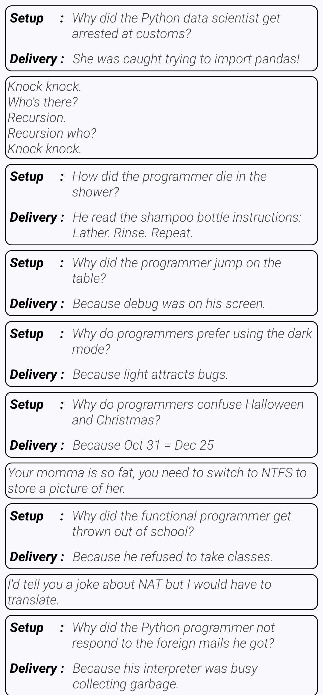

# Programming Jokes (Android • Kotlin • Jetpack Compose)

A simple Android app that fetches programming jokes from JokeAPI and displays them in a clean Jetpack Compose UI with pull-to-refresh. Built with MVVM, Retrofit, and Material 3.

## Features
- Pull-to-refresh list of jokes
- Supports single and two-part jokes (setup + delivery)
- Error fallback when offline
- Modern Material 3 styling

## Tech Stack
- Kotlin, Coroutines, ViewModel (MVVM)
- Jetpack Compose + Material 3
- Retrofit + Gson Converter
- Gradle Version Catalog

## App Details
- Package: `com.receparslan.programmingjokes`
- Min SDK: `24`
- Target/Compile SDK: `36`
- Kotlin: `2.2.21`
- Android Gradle Plugin: `8.13.1`
- Compose BOM: `2025.11.00`

## API
- Base URL: `https://v2.jokeapi.dev`
- Endpoint used: `/joke/Programming?blacklistFlags=nsfw,religious,political,racist,sexist,explicit&amount=10`

## Screenshots
| Home Screen                                                 |
|-------------------------------------------------------------|
|   | 

## Project Structure
```
app/
  src/main/
    java/com/receparslan/programmingjokes/
      MainActivity.kt
      model/Jokes.kt
      services/JokeApiService.kt
      screens/JokeListScreen.kt
      viewmodel/JokeViewModel.kt
      ui/theme/{Color,Theme,Type}.kt
    res/values/strings.xml
  build.gradle.kts
```

## Getting Started
### Prerequisites
- Android Studio (latest stable)
- Android SDK Platform 36
- A device or emulator running Android 7.0+ (API 24+)

### Open in Android Studio
1. File → Open → select this project folder
2. Let Gradle sync finish
3. Run the `app` configuration on a device/emulator

### Build via Gradle (Windows PowerShell)
```powershell
# From the project root
.\gradlew.bat clean
.\gradlew.bat :app:assembleDebug
# Optional: install to connected device
.\gradlew.bat :app:installDebug
```

## How It Works
- `JokeApiService` uses Retrofit + Gson to call JokeAPI
- `JokeViewModel` fetches data on init and exposes state
- `JokeListScreen` renders a `LazyColumn` with pull-to-refresh

## License
This project is licensed under the MIT License – see the [LICENSE](LICENSE) file for details.

---
If you want a different license or extra docs (Contributing, CI, etc.), let me know and I’ll add them.
